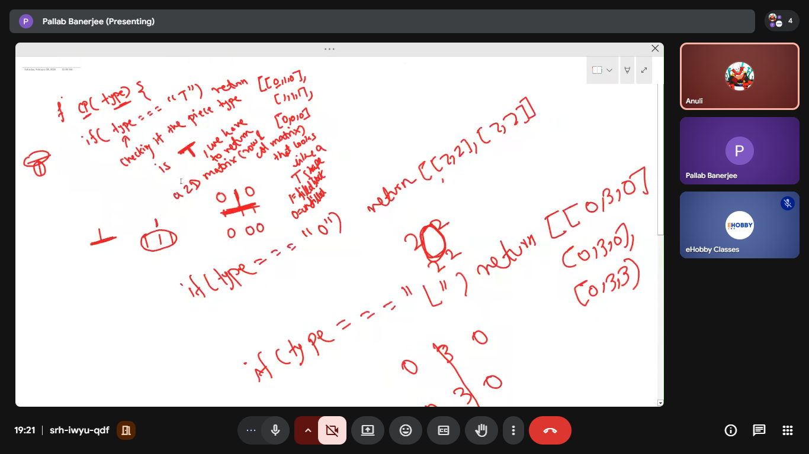

<!-- ===============================
     BASIC DOCUMENT SETUP
     =============================== -->

<!-- Declare HTML5 document type -->

<!-- Set language to English -->

<!-- Add meta charset for UTF-8 encoding -->

<!-- Add viewport meta tag for responsive design -->

<!-- Set page title (e.g., "Tetris Game") -->

<!-- Link external CSS file (style.css) -->

<!-- ===============================
     MAIN GAME LAYOUT
     =============================== -->

<!-- Create a main container to hold the entire game -->

<!-- Inside container, create a game wrapper (flex layout) -->

<!-- ===============================
     TETRIS GAME BOARD (CANVAS)
     =============================== -->

<!-- Add a <canvas> element for the Tetris grid -->

<!-- Set canvas width and height (example: 240x400) -->

<!-- Give the canvas an ID (e.g., id="tetris") -->

<!-- ===============================
     SIDE PANEL (GAME INFO)
     =============================== -->

<!-- Create a side panel div for score and controls -->

<!-- Add a heading (h1) for the game title "TETRIS" -->

<!-- Create a score display section -->

<!-- Add a span inside score to dynamically update points -->

<!-- ===============================
     CONTROL INSTRUCTIONS
     =============================== -->

<!-- Add a div to show keyboard controls -->

<!-- Example:
     Left Arrow = Move Left
     Right Arrow = Move Right
     Down Arrow = Drop
     Up Arrow = Rotate -->

<!-- ===============================
     RESTART BUTTON
     =============================== -->

<!-- Add a restart/reset button -->

<!-- Use onclick to call resetGame() function -->

<!-- ===============================
     SCRIPT CONNECTION
     =============================== -->

<!-- Link external JavaScript file (script.js) at the end of body -->

<!-- Ensure script loads after DOM elements for proper access -->

/* ===============================
   GLOBAL BODY STYLING
   =============================== */

/* Remove default margin and padding from body */

/* Set box-sizing to border-box for consistent layout */

/* Apply a modern readable font (e.g., Segoe UI, sans-serif) */

/* Make body height full screen using 100vh */

/* Add a dark gradient background for gaming theme */

/* Use flexbox to center the game container horizontally */

/* Center the game container vertically using align-items */

/* Set default text color to white for dark UI */

/* ===============================
   MAIN GAME CONTAINER (.game-container)
   =============================== */

/* Use display: flex to place canvas and panel side by side */

/* Add gap between the canvas and the side panel */

/* Align items vertically in the center */

/* This container holds the entire Tetris layout */

/* ===============================
   CANVAS (GAME BOARD) - #tetris
   =============================== */

/* Set dark background color for the game board */

/* Add a solid border around canvas (neon style) */

/* Add glowing box-shadow for modern game look */

/* Keep fixed width and height (grid based rendering) */

/* ===============================
   SIDE PANEL STYLING (.panel)
   =============================== */

/* Add padding inside the panel (around 20px) */

/* Set a dark background color slightly lighter than body */

/* Add border-radius for rounded modern corners */

/* Add box-shadow for depth and floating effect */

/* Set a fixed width for clean layout (e.g., 160px–200px) */

/* ===============================
   GAME TITLE (h1 inside panel)
   =============================== */

/* Increase font size for strong heading */

/* Add margin-bottom for spacing below title */

/* Change title color to accent color (cyan/blue) */

/* ===============================
   SCORE TEXT (.score)
   =============================== */

/* Increase font-size for visibility */

/* Add margin-bottom for spacing */

/* Keep text bold for emphasis */

/* ===============================
   CONTROL TEXT (.controls)
   =============================== */

/* Use smaller font-size for instruction text */

/* Add line-height for readability */

/* Reduce opacity slightly for secondary text look */

/* ===============================
   RESTART BUTTON STYLING (button)
   =============================== */

/* Add margin-top to separate from controls */

/* Add padding inside the button */

/* Set button width to 100% of panel */

/* Remove default border */

/* Add border-radius for smooth edges */

/* Set bright background color (cyan/blue theme) */

/* Set text color dark for contrast */

/* Make font bold */

/* Change cursor to pointer on hover */

/* Add transition for smooth hover animation */

/* ===============================
   BUTTON HOVER EFFECT (button:hover)
   =============================== */

/* Darken background color on hover */

/* Create interactive feel with smooth transition */

/* ===============================
   OPTIONAL ADVANCED UI EFFECTS
   =============================== */

/* Add glow effect using stronger box-shadow */

/* Add transform scale on hover for modern feel */

/* Add responsive media query for smaller screens */

______-

/* ===============================
   CANVAS INITIALIZATION
   =============================== */

// Select the canvas element using its ID (#tetris)

// Get the 2D drawing context from the canvas

// Scale the canvas context (20x20)
// This makes each block = 20px for grid rendering

____________________________________

/* ===============================
   SCORE ELEMENT SELECTION
   =============================== */

// Select the score span from DOM
// This will dynamically update the player score

/* ===============================
   MATRIX (GRID) CREATION FUNCTION
   =============================== */

// Create a function createMatrix(width, height)
// This generates the arena (game board grid)

// Use a loop to fill rows with 0 values
// 0 means empty cell in the grid

/* ===============================
   TETRIS PIECE GENERATOR
   =============================== */

// Create function createPiece(type)

// Define different shapes:
// T, O, L, J, I, S, Z pieces

// Each piece is represented as a matrix (2D array)

// Non-zero numbers represent colored blocks

/* ===============================
   COLOR SYSTEM FOR BLOCKS
   =============================== */

// Create an array of colors
// Each index corresponds to a piece type color

/* ===============================
   ARENA (GAME BOARD) SETUP
   =============================== */

// Create the arena using createMatrix(12, 20)
// 12 columns (width)
// 20 rows (height)
// This is the main Tetris grid

/* ===============================
   PLAYER OBJECT (GAME STATE)
   =============================== */

// Create player object containing:
// pos.x = horizontal position
// pos.y = vertical position
// matrix = current falling piece
// score = player score

/* ===============================
   COLLISION DETECTION FUNCTION
   =============================== */

// Function: collide(arena, player)

// Check if current piece touches:
// - Floor
// - Walls
// - Existing blocks in arena

// Loop through piece matrix
// If non-zero cell overlaps arena block → return true

// Prevents illegal movement

/* ===============================
   MERGE FUNCTION (LOCK PIECE)
   =============================== */

// Function: merge(arena, player)

// When piece lands, copy piece values into arena grid

// This permanently places the block in the board

/* ===============================
   LINE CLEARING SYSTEM (CORE TETRIS LOGIC)
   =============================== */

// Function: arenaSweep()

// Loop from bottom row upwards

// Check if a row is completely filled (no zeros)

// If full row detected:
// Remove the row using splice()
// Add empty row at top using unshift()

// Increase score when line is cleared

// Update score text in DOM

/* ===============================
   MATRIX ROTATION (BLOCK ROTATION)
   =============================== */

// Function: rotate(matrix)

// Transpose the matrix (swap rows & columns)

// Reverse each row to rotate clockwise

// Used when user presses ArrowUp

/* ===============================
   PLAYER DROP FUNCTION (GRAVITY)
   =============================== */

// Function: playerDrop()

// Move piece down by increasing pos.y

// If collision occurs:
// Move piece back up
// Merge piece into arena
// Clear lines (arenaSweep)
// Spawn new piece (playerReset)

// Reset drop counter for timing

/* ===============================
   PLAYER MOVEMENT (LEFT & RIGHT)
   =============================== */

// Function: playerMove(dir)

// dir = -1 → move left
// dir = 1 → move right

// Update player x position

// If collision detected → revert movement

/* ===============================
   PLAYER ROTATION CONTROLLER
   =============================== */

// Function: playerRotate()

// Store original x position

// Rotate current piece matrix

// If rotation causes collision:
// Restore original position

/* ===============================
   PLAYER RESET (NEW PIECE SPAWN)
   =============================== */

// Function: playerReset()

// Randomly select a new p

_____________________

// Select the canvas element from the HTML using its ID

// Get the 2D drawing context from the canvas

// Scale the canvas so each grid block becomes larger (20x20 pixels)

// Select the score display element from the HTML

// Create a function that generates a 2D matrix (game grid)
// Initialize an empty array to store rows
// Use a loop to create 'h' number of rows
// Fill each row with 'w' number of zeros
// Return the completed matrix

// Create a function that returns a Tetris piece based on type
// If type is "T", return the T shape matrix
// If type is "O", return the square shape matrix
// If type is "L", return the L shape matrix
// If type is "J", return the J shape matrix
// If type is "I", return the line shape matrix
// If type is "S", return the S shape matrix
// If type is "Z", return the Z shape matrix

// Create an array to store colors for each block type
// Keep first value null for empty cells

// Create the main arena grid with 12 columns and 20 rows

// Create a player object
// Store player position (x and y)
// Store current piece matrix
// Store player score

// Create a function to check collision between player piece and arena
// Get the player's matrix and position
// Loop through each row of the piece
// Loop through each column of the piece
// Check if the block is not zero
// Check if the arena cell at that position is occupied
// If collision found, return true
// If no collision, return false

// Create a function to merge the player piece into the arena
// Loop through each row of the player matrix
// Loop through each value in the row
// If value is not zero, place it into the arena grid at correct position

// Create a function to clear filled rows (arena sweep)
// Loop from bottom row to top
// Check if every cell in the row is filled
// If a full row is found, remove that row
// Add a new empty row at the top
// Increase the player score
// Update the score display

// Create a function to rotate a matrix (Tetris piece)
// Transpose the matrix (swap rows and columns)
// Reverse each row to complete rotation

// Create a function to drop the player piece down by one step
// Increase player's y position
// Check for collision after moving down
// If collision happens, move piece back up
// Merge the piece into the arena
// Clear completed rows
// Reset the player with a new piece
// Reset the drop counter

// Create a function to move the player left or right
// Change player x position based on direction
// If collision occurs, undo the movement

// Create a function to rotate the player piece
// Save the current x position
// Rotate the matrix
// If collision happens after rotation, restore old position

// Create a function to reset the player with a new random piece
// Select a random piece type from all available shapes
// Generate the new piece matrix
// Set player position to top center of the arena
// If collision occurs immediately, reset the arena grid
// Reset the player score
// Update the score display

// Create a function to draw a matrix on the canvas
// Loop through each row of the matrix
// Loop through each value in the row
// If value is not zero, set fill color
// Draw a rectangle block at correct position

// Create a function to draw the entire game
// Fill the canvas background with dark color
// Draw the arena grid
// Draw the current player piece

// Initialize drop counter variable
// Initialize drop interval (game speed)
// Initialize last time variable for animation timing

// Create the main update function for the game loop
// Calculate time difference between frames
// Add delta time to drop counter
// If drop counter exceeds interval, drop the piece
// Call the draw function
// Request the next animation frame (loop the game)

// Add keyboard event listener for controls
// If Left Arrow pressed, move player left
// If Right Arrow pressed, move player right
// If Down Arrow pressed, drop the piece faster
// If Up Arrow pressed, rotate the p

________________

 // Rotate the piece matrix by transposing and reversing rows

// Loop through matrix rows and columns to swap diagonal elements

// Reverse each row to complete 90° rotation

// Move the player piece down by one block

// Check for collision with arena or bottom

// If collision occurs, move piece back up

// Merge the piece into the arena grid

// Clear completed rows and update score

// Reset player with a new piece

// Reset drop counter for timing

// Move the player piece left or right based on direction

// Check collision after movement

// Revert movement if collision is detected

// Store current horizontal position before rotation

// Rotate the player piece matrix

// Check collision after rotation

// Revert position if rotation causes collision

// Select a random Tetris piece type

// Create a new piece matrix

// Reset vertical position to top

// Center the piece horizontally in the arena

// Check for immediate collision (game over condition)

// Loop through matrix rows and columns to draw blocks

// Draw only non-zero values as colored blocks

// Use offset to position the piece correctly on canvas

// Fill the canvas background

// Clear previous frame

// Draw the arena (placed blocks)

// Track time difference between frames

// Increase drop counter using delta time

// Automatically drop piece based on drop interval

// Redraw the game each frame

// Call update continuously using requestAnimationFrame

// Listen for keyboard input events

// Move left when left arrow is pressed

// Move right when right arrow is pressed

// Drop piece faster when down arrow is pressed

// Rotate piece when up arrow is pressed

// Clear the arena grid

// Reset player score to zero

// Update score display

// Reset player with a new piece

// Initialize the first player piece

// Start the game loop 